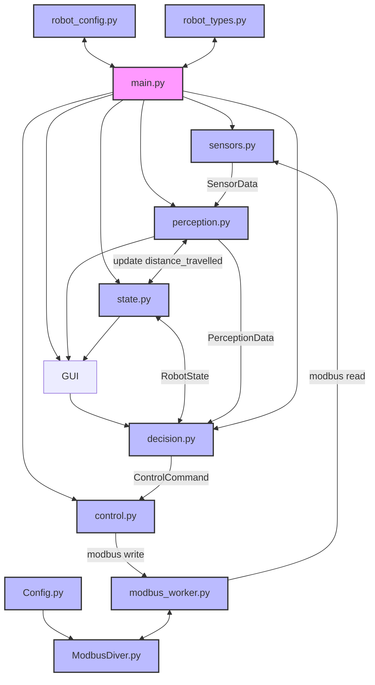

# Jaska-mobiilirobotin käyttö- ja ohjaussovellus
Jaska-mobiilirobotin käyttö- ja ohjaussovellus on kehitysvaiheessa oleva ohjelmistokokonaisuus, jonka jatkokehitys on suunniteltu projektin seuraavissa vaiheissa. Sovellus sisältää graafisen käyttöliittymän, manuaaliohjauksen sekä yksinkertaisen autonomisen toiminnon.

Autonomisessa tilassa robotille annetaan kuljettava etäisyys, jonka perusteella robotti liikkuu suoraviivaisesti eteenpäin ja pysähtyy saavutettuaan määritellyn matkan.

Ohjelmistokokonaisuuteen on liitetty tuki erilaisten anturitietojen lukemiselle. Tällä hetkellä robotti kykenee lukemaan vain moottoriohjaimilta saatavaa tilatietoa, mutta ohjelmistoon on rakennettu valmiit rakenteet kameran syvyystiedon, IMU-datan sekä IO-signaalien lukemista varten FastAPI-rajapintoja hyödyntäen.

Lisäksi ohjelmistoon on toteutettu sensorisimulaattori, jonka avulla järjestelmän toimintoja voidaan testata ilman fyysisiä antureita. Simulaattori mahdollistaa simuloidun anturidatan lähettämisen järjestelmään FastAPI-rajapintojen kautta.

## Käyttö
Tällä hetkellä ohjelmiston käyttö edellyttää yhteyden muodostamista Jaska-mobiilirobotissa olevaan tietokoneeseen. Yhteys voidaan muodostaa esimerkiksi SSH-yhteyden avulla, minkä jälkeen sovellus käynnistetään manuaalisesti robotin tietokoneella.

Jaska yhdistyy langattomaan **Robo_Device_net_5G** -verkkoon.

---

### Käynnistys
Käännä Jaskan peräpanelissa sijaitseva pääkytkin (**MAIN SWITCH**) asentoon **ON**.
Tämän jälkeen:

1. **BATTERY 3 VOLTAGE** -mittariin ilmestyy jännite.
2. Varmista, että hätäseis-painike (**E-STOP**) on vapautettu.
3. Reset-painikkeeseen syttyy merkkivalo.
4. Paina reset-painiketta. Tämä kuittaa hätäseis-piirin ja kytkee jännitteen moottorikorteille.


Kun tietokone on käynnistynyt, robotti on käyttövalmis.

> **HUOM!**  
> Ohjelmistossa on havaittu pieni ongelma USB-laitteiden alustuksessa.  
> Suositellaan, että tietokoneen käynnistyksen jälkeen USB-laitteet irrotetaan ja kytketään uudelleen.

---

### Yhteyden muodostaminen
Yhteys robotin tietokoneeseen muodostetaan esimerkiksi seuraavasti:

```bash
olliopiskelija@tietokone:~$ ssh user@192.168.123.175
user@192.168.123.175's password: admin
```
### Sovelluksen käynnistäminen

Ohjelma käynnistetään Jaskassa olevassa **ZEDBOX**-tietokoneessa suorittamalla seuraava komento:

```bash
user@GTW-ONX16-ubuntu:~$ jaskagui
```
---

### Käyttöliittymä
Avaa selain laitteella, joka on samassa verkossa kuin robotti(Robo_Device_net_5G), ja siirry osoitteeseen:
```
 http://192.168.123.175:8080/   
```
(vaihtoehtoisesti: http://[robotin IP-osoite]:8080) 
Selain avaa graafisen käyttöliittymän, jonka avulla robottia voidaan ohjata ja sen tilaa seurata.


> **HUOM!** 
> Jos Modbus-väylän lukeminen ei onnistu: 
> 1. Sammuta ohjelma. 
> 2. Varmista, että hätäseis on kuitattu ja moottorikorteille menee virta.
> 3. Irroita ja kytke USB mokkula uudelleen.
> 4. käynnistä ohjelma uudellen.

---

### Käyttö simulaattorilla
Jos halutaan testata järjestelmän toiminnallisuutta siten, että kameran syvyys-, IMU- ja IO-tiedot ovat simuloituja, suorita seuraava komento:

```bash
user@GTW-ONX16-ubuntu:~$ sensor_sim
========================================
 Kamera-simulaattorin käynnistys
========================================
....
....
....
```
Käynnistä tämän jälkeen robottisovellus:
```bash
user@GTW-ONX16-ubuntu:~$ jaskagui
```
Avaa lopuksi toisessa terminaalissa sensor_sim_ui-käyttöliittymä, jolla voidaan syöttää simuloitua anturidataa järjestelmälle.

```bash
user@GTW-ONX16-ubuntu:~$ sensor_sim_ui
```


Sensor simulaattori voidaan sulkea suorittamalla komento:
```bash
user@GTW-ONX16-ubuntu:~$ sensor_sim_down
```
> **HUOM!**
> Jos käyttö liittymä ei tunnista simuloituja antureita niin,
> varmista että olet käynnistänyt simulaattorin ja *jaskagui* käyttöliittymän samassa terminaalissa.
> varmista että ympäristö muuttujat "IMU_AVAILABLE, IO_VAILABLE ja CAMERA_AVAILABLE" on oikein
> varmista että ympäristö muuttujilla "IMU_URL, IO_URL ja CAMERA_URL" osoitteet on oikein.
> muuttujat voi varmistaa esimerkiksi komennolla:
```bash 
user@GTW-ONX16-ubuntu:~$ echo $CAMERA_AVAILABLE
```
> tämän jälkeen pitäisi tulla vastaus
```bash 
1
```
---

## Ohjelmiston rakenne

Ohjelma jaetaan yhteen pääohjelmaan ja kymmeneen aliohjelmaan, sekä GUI kokonaisuuteen.

* [main.py](docs/main.md)
* [robot_types.py](docs/robot_types.md)
* [sensors.py](docs/sensors.md)
* [perception.py](docs/perception.md)
* [decision.py](docs/decision.md)
* [control.py](docs/control.md)
* [state.py](docs/state.md)
* [robot_config.py](docs/robot_config.md)
* [Config.py](docs/Config.md)
* [ModbusDriver.py](docs/ModbusDriver.md)
* [modbus_worker.py](docs/modbus_worker.md)

- [**gui/**](docs/GUI.md)
    - \_\_init\_\_.py
    - [app.py](docs/GUI.md#apppy)
    - **pages/**
        - [dashboard.py](docs/GUI.md#dashboardpy)
        - [config.py](docs/GUI.md#configpy)
        - [control.py](docs/GUI.md#controlpy)
        - [errors.py](docs/GUI.md#errorspy)
        - [state.py](docs/GUI.md#statepy) (*ei käytössä*) 
        
### lyhyesti
#### main.py

Pääohjelma, joka suorittaa robottia jatkuvassa silmukassa.
yhdistää kaikki moduulit toisiinsa, mutta ei sisällä päätöksen tekologiikkaa.

vastuut:

* pääsilmukka
* tilan välitys kierrokselta toiselle
* kutsuu muita moduuleja
* antaa käskyn käynnistää guin. 

#### robot_types.py

Määrittelee koko ohjelmassa käytettävät yhteiset tietotyypit ja niiden rakenteet. Varmistaa, että moduulit käyttävät keskenään yhtenäisiä datamuotoja.

esim.

 ``` python

from dataclasses import dataclass

@dataclass(frozen=True)
class SensorData:
    motor1_measured_RPM: float
    motor3_measured_RPM: float
    motor4_measured_RPM: float
    motor6_measured_RPM: float

@dataclass(frozen=True)
class RobotState:
    mode: str
    last_turn: str | None
```
#### sensors.py

Kerää datan eri sensoreilta (esim. IMU, Kamera) ja palauttaa sen yhtenäisessä muodossa.

#### perception.py

Tulkaa sensoridatan korkeammalle tasolle. Muuntaa raakadataa robottia ohjaaviksi havainnoiksi

Esim. 

* Este edessä / ei estettä
* mitattu nopeus tällä hetkellä (sensoridatasta)
* suuntima /headind (asteta)

#### decision.py

Sisältää päätöksentekologiikan ja tilakoneen.
päättää robotille annettavat käskyt havainnoinnin ja nykytilan perusteella.

* pysähdy
* aja eteen
* käänny vasemmalle / oikealle

#### control.py

Muuntaa päätökset konkreettisiksi moottori- ja ohjauskomennoiksi.

Vastuut: 
* nopeudet
* kääntöliikkeet
* rajapinta moottori ohjaimiin.

#### state.py

Määrittelee  robotin sisäisen tilan ja muistin, joka kulkee kierrokselta toiselle.

Esimerkkejä:
* nykyinen toimintatila
* edellinen tila
* käännöksen suunta
* tilassa vietetty aika tai askeleet

#### robot_config.py
Sisältää kaikki säädettävät parametrit ja raja-arvot, jotka eivät muutu ajonaikana.

Esimerkiksi:
* renkaan koko
* maksimi- ja perusnopeudet
* esteen minimi etäisyys
* aikarajat

luo myös config.json tiedoston niille muuttujille, joita on mahdollista muuttaa guista,
kuten perus nopeudet 
#### modbus_worker.py
Käsittelee yhdessä paikassa modbussin lukemis ja kirjoitus pyynnit.
#### Modbusdrive.py
Sisältää varsinaiset modbus funktiot.

#### Config.py 
sisältää modbusväylän konfiguraatiot

---

## Vuokaavio
### Pääohjelmisto rakenne
#### Legend
- 🟣 Main program
- 🔵 Module



---
