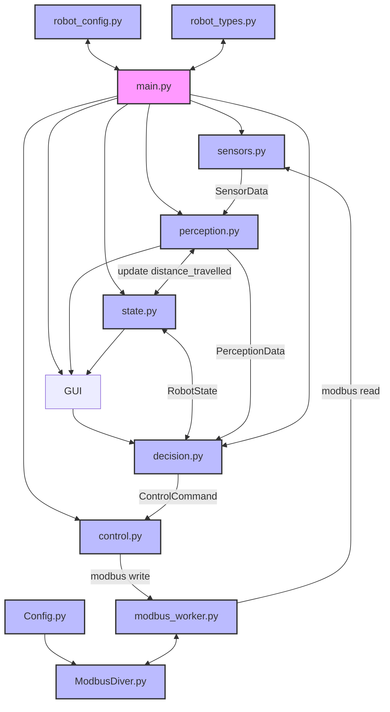

# Jaska Automation

## Rakenne

Ohjelma jaetaan yhteen pääohjelmaan ja kymmeneen aliohjelmaan, sekä GUI kokonaisuuteen.

* [main.py](docs/main.md)
* [robot_types.py](docs/robot_types.md)
* [sensors.py](docs/sensors.md)
* [perception.py](docs/perception.md)
* [decision.py](docs/decision.md)
* [control.py](docs/control.md)
* [state.py](docs/state.md)
* [robot_config.py](docs/robot_config.md)
* [Config.py](docs/Config.md)
* [ModbusDriver.py](docs/ModbusDriver.md)
* [modbus_worker.py](docs/modbus_worker.md)

- **gui/**
    - \_\_init\_\_.py
    - app.py
    - **pages/**
        - dashboard.py
        - config.py
        - control.py
        - errors.py
        - state.py (*ei käytössä*) 
        
### lyhyesti
#### main.py

Pääohjelma, joka suorittaa robottia jatkuvassa silmukassa.
yhdistää kaikki moduulit toisiinsa, mutta ei sisällä päätöksen tekologiikkaa.

vastuut:

* pääsilmukka
* tilan välitys kierrokselta toiselle
* kutsuu muita moduuleja
* antaa käskyn käynnistää guin. 

#### robot_types.py

Määrittelee koko ohjelmassa käytettävät yhteiset tietotyypit ja niiden rakenteet. Varmistaa, että moduulit käyttävät keskenään yhtenäisiä datamuotoja.

esim.

 ``` python

from dataclasses import dataclass

@dataclass(frozen=True)
class SensorData:
    motor1_measured_RPM: float
    motor3_measured_RPM: float
    motor4_measured_RPM: float
    motor6_measured_RPM: float

@dataclass(frozen=True)
class RobotState:
    mode: str
    last_turn: str | None
```
#### sensors.py

Kerää datan eri sensoreilta (esim. IMU, Kamera) ja palauttaa sen yhtenäisessä muodossa.

#### perception.py

Tulkaa sensoridatan korkeammalle tasolle. Muuntaa raakadataa robottia ohjaaviksi havainnoiksi

Esim. 

* Este edessä / ei estettä
* mitattu nopeus tällä hetkellä (sensoridatasta)
* suuntima /headind (asteta)

#### decision.py

Sisältää päätöksentekologiikan ja tilakoneen.
päättää robotille annettavat käskyt havainnoinnin ja nykytilan perusteella.

* pysähdy
* aja eteen
* käänny vasemmalle / oikealle

#### control.py

Muuntaa päätökset konkreettisiksi moottori- ja ohjauskomennoiksi.

Vastuut: 
* nopeudet
* kääntöliikkeet
* rajapinta moottori ohjaimiin.

#### state.py

Määrittelee  robotin sisäisen tilan ja muistin, joka kulkee kierrokselta toiselle.

Esimerkkejä:
* nykyinen toimintatila
* edellinen tila
* käännöksen suunta
* tilassa vietetty aika tai askeleet

#### robot_config.py
Sisältää kaikki säädettävät parametrit ja raja-arvot, jotka eivät muutu ajonaikana.

Esimerkiksi:
* renkaan koko
* maksimi- ja perusnopeudet
* esteen minimi etäisyys
* aikarajat

luo myös config.json tiedoston niille muuttujille, joita on mahdollista muuttaa guista,
kuten perus nopeudet 
#### modbus_worker.py
Käsittelee yhdessä paikassa modbussin lukemis ja kirjoitus pyynnit.
#### Modbusdrive.py
Sisältää varsinaiset modbus funktiot.

#### Config.py 
sisältää modbusväylän konfiguraatiot

---

## Vuokaavio
### Pääohjelmisto rakenne
#### Legend
- 🟣 Main program
- 🔵 Module



---
