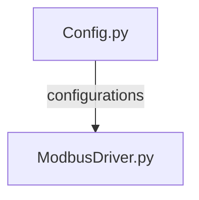

# Config.py

Moduuli on lainattu Metropolia ammattikorkeakoulun oppilaalta Samuli Ahokkaalta. Moduulin tarkoituksena on konfiguroida usb portti modbus väylän lukua varten. Sisältää myös PS4 ohjaimen nappien konfigurointiin liittyviä parametrejä. 

