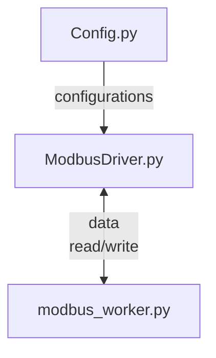

# ModbusDriver.py

Modubus väylän lukemiseen ja kirjoittamiseen tarkoitettu moduuli, luonut Metropolia ammattikorkeakoulun oppilas Samuli Ahokas.  

## Kehitys ideoita

* Moottori ohjaimia pystyy parametroimaan modbus väylän kautta, niin siihen liittyvät funktiot voisi tehdä.
* Vaihtaa printit loggereihin, nyt häiriö tilanteessa printit tukkivat kaistan. 