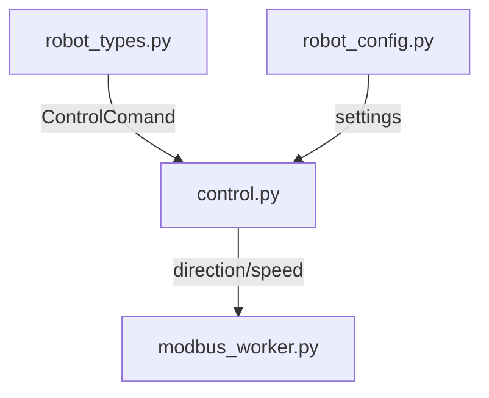
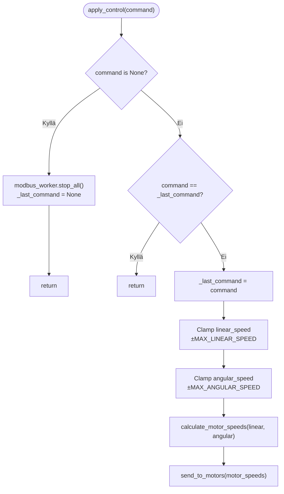
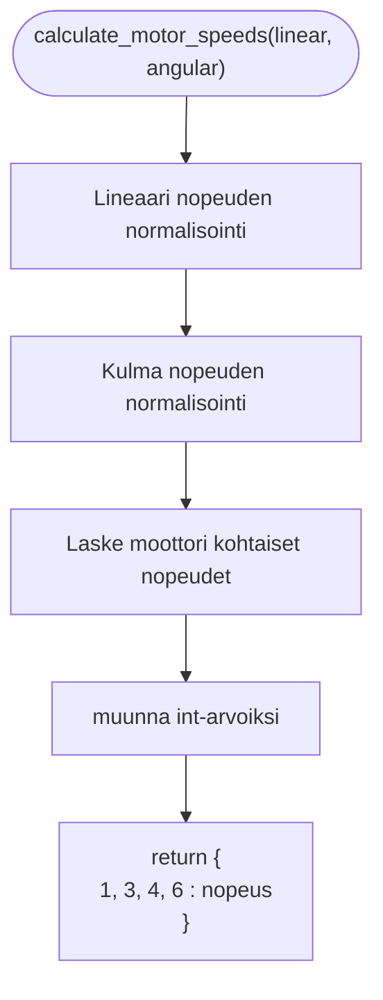
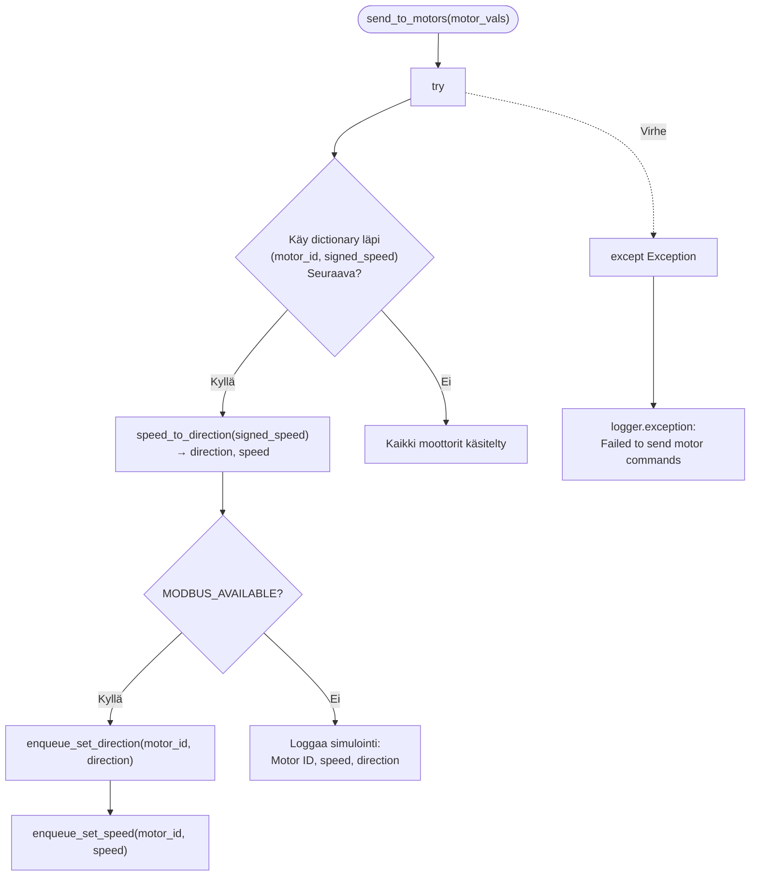

# control.py

Moduulin tarkoituksena on ottaa vastaan ohjauskäskyt, muuttaa ne moottorin ohjauskorteille sopiviin muotoihin ja lähettää ne modbusworkerille eteenpäin.

## Funktiot

### apply_control(command: ControlCommand | None):

Modulin pääfunktio jota käytetään mainissa olevaas control loopissa. Funktion tarkoituksena on lähettää käskyt moottoreille jos ohjaus käsky on muuttunut. Moottorin nopeudet rajataan niin että nopeus ohjeet eivät voi ylittää maksimi arvoja. 

### calculate_motor_speeds(linear: float, angular: float) -> dict[int, int]:

Funktion tarkoituksena on laskea moottori kohtaiset nopeudet lineaari ja kulmanopeuksista. 
ja palauttaa moottorikohtaisen dictionaryn jossa on moottori kohtaiset nopeusohjeet.

#### Vuokaavio

#### Nopeuksien normalisointi

nopeudet normalisoidaan kaavalla $$ v_{norm} = \frac {v}{v_{max}} $$

jossa

$v_{norm} = $ normalisoitu lineaari- tai kulmanopeus
$v =  $ lineaari- tai kulmanopeus ohje
$v_{max}= $ lineaari tai kulmanopeuden maximi (MAX_LINEAR_SPEED, MAX_ANGULAR_SPEED) arvo joka on määritelty robot_confic.py moduulissa.

Jos maks arvot ei ole saatavilla niin normalisoiduksi arvoksi määritetään 0.0

#### moottori kohtaisen nopeuden laskenta

Paarpuurin puoleiset moottorit lasketaan kaavalla $$C_P=(v_{norm_{L}}-v_{norm_{A}})\cdot C_{max} $$

ja styyrpuurin puoleiset lasketaan kaavalla $$C_S=(v_{norm_{L}}+v_{norm_{A}})\cdot C_{max} $$

jossa

$C_P$ = paarpuurin puoleisten moottorien ohjauskomento

$C_S$ = styyrpuurin puoleisten moottorien ohjauskomento

$v_{norm_{L}} $ = normalisoitu lineaarinen nopeus

$v_{norm_{A}} $ = normalisoitu kulmanopeus

$C_{max} $ = moottoriohjaimelle annettavan nopeuskomennon maksimiarvo
(vastaa MAX_SPEED_VALUE-vakioita, määritelty robot_config.py-moduulissa) 

##### Havaittu rajoite

Mikäli sekä lineaarinen että kulmanopeus saavuttavat maksimiarvonsa samanaikaisesti, voi moottorikohtainen ohjauskomento ylittää sallitun maksimiarvon 
$C_{max}$ esim⁡. $$v_{norm_{L}}=1, \quad v_{norm_{A}}=1 $$
joka johtaa tulokseen $$C_S= 2 \cdot C{max} $$
Tällöin ohjausarvo joudutaan rajaamaan moottoriohjaimen tai alempien ohjelmistokerrosten toimesta, mikä voi aiheuttaa liikkeen suunnan vääristymistä äärimmäisissä ohjaustilanteissa.

##### Vaikutus järjestelmän toimintaan

Käytännössä järjestelmä toimii turvallisesti, sillä:

* yksittäiset nopeuskomennot rajataan
* moottoriohjaimet eivät hyväksy arvoja yli sallittujen rajojen

Kuitenkin:
* lineaarisuuden säilyminen ei ole taattu
* kaarreliike voi vääristyä maksimiarvojen läheisyydessä

##### Kehitysehdotus

Jatkokehityksessä ohjauskomennot voidaan skaalata yhteisesti siten, että suurin moottorikohtainen arvo ei ylitä sallittua rajaa.

Yksi yleinen ratkaisu on yhteinen skaalaus: $$m = max(|v_L + v_A|, \: |v_L-v_A|) $$
mikäli $m>1$, molemmat arvot skaalataan: $$v_{L}'=\frac {v_L}{m}, \quad v_A' =\frac {v_A}{m} $$
Tämän jälkeen moottorikohtaiset ohjauskomennot lasketaan käyttäen skaalattuja arvoja.

Tämä menetelmä säilyttää liikesuunnan ja estää ohjausarvojen yliohjauksen.

### send_to_motors(motor_vals: dict[int, int]):

Funktion tarkoituksena on käyttää lähettää suunta ja nopeus ohjeet modbus_workkerille. Funktio saa dictionaryn jossa on moottorin nopeus ohje merkillisenä. Se käyttää funktiota speed_to_direction() jossa erotellaan itse nopeus ohje ja suunta omaksi arvoksi, tämän jälkeen suunta ja nopeus lähetetään modbus_workerille.

#### Vuokaavio

### speed_to_direction(speed: int) -> tuple[int, int]

Funktio muuttaa etumerkillisen nopeuden (±) suunnaksi ja nopeudeksi. Jos nopeus on positiivista suunnaksi määritellään 0 (eteen) jos negatiivista niin 1 (taakse). 
funktio palauttaa suunnan ja nopeuden absoluuttisen arvon. 

### emergency_stop():
Jos MODBUS_AVAILABLE niin nollataan viimeinen käsky ja suoritetaan modbus_worker.emergency_stop() funktio joka lähettää kaikille moottoreille pysäytys käskyn ja pois poistaa moottorit käytöstä. 

***Huom!**: Käytä harkiten moottorien käyttöön palauttaminen voi vaatia koko järjestelmän uudelleen käynnistystä.

### stop_all_motors():

Funktion tarkoituksena on lähettää pysäytys käsky kaikille moottoreille modbus_workeriin.