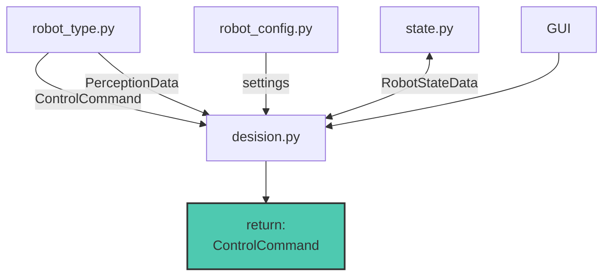
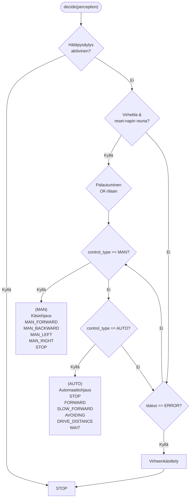
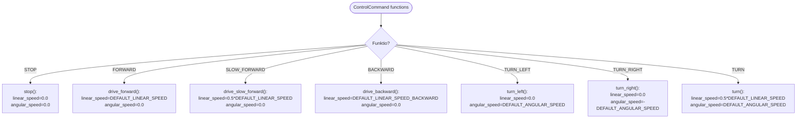
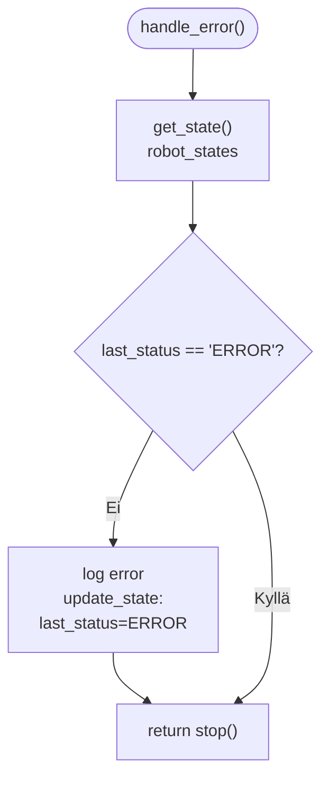
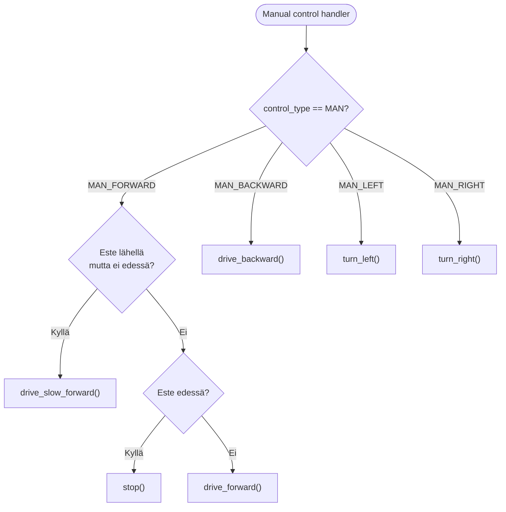
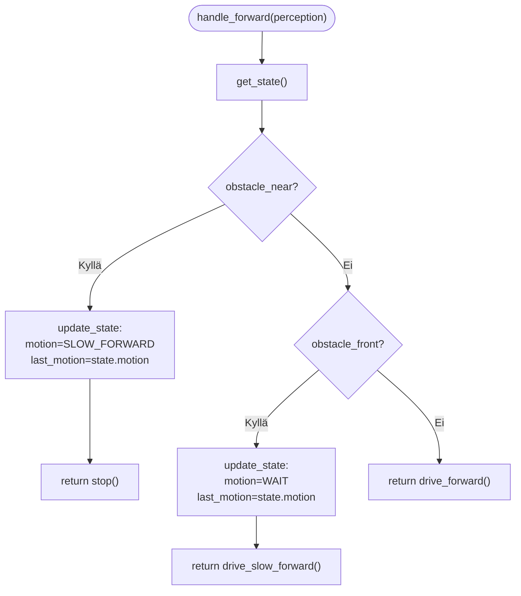
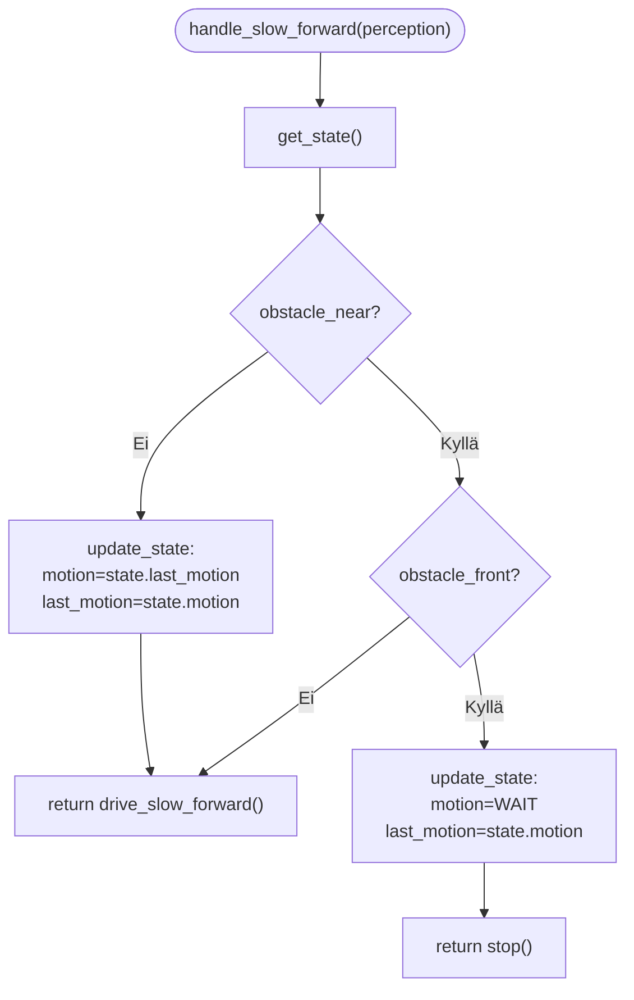
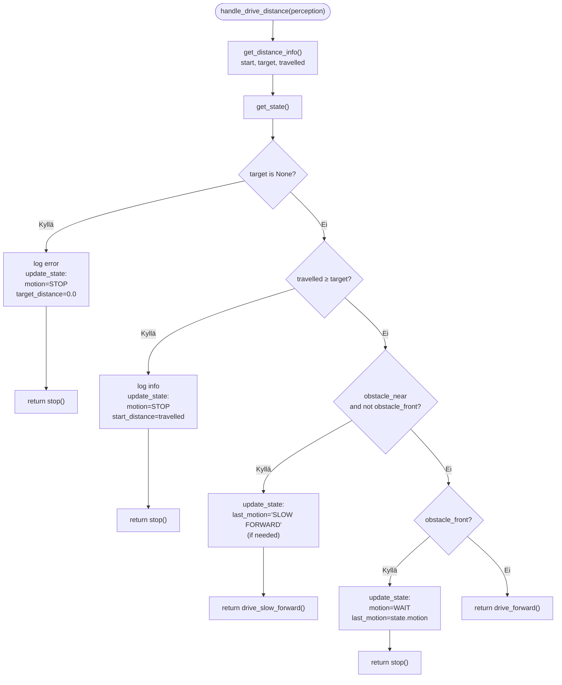
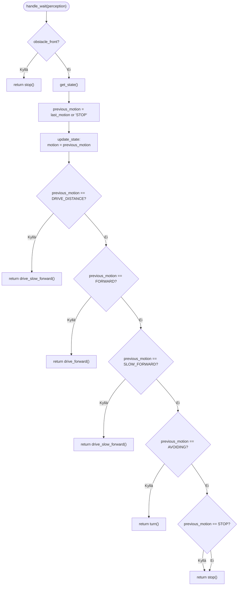
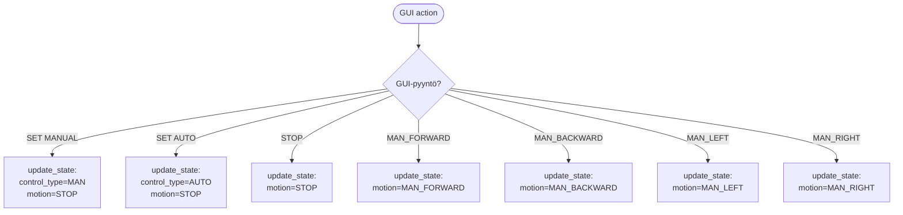

# decision.py

Moduulin tehtävänä on tehdä päätökset statuksen mukaan ja välittää ohjauskäskyt controlliin.
Moduuli sisltää tilakoneet ja häiriön käsittelyn.

---
## Funktiot
###  decide(perception: PerceptionData) -> ControlCommand:
Moduulin "pääfunktio" jonka tarkoitus on toimia tilakoneena jota käytetään mainissa.
Funktio lukee perception datan ja tarkkailee missä tilassa robotti on ja sen mukaan muuttaa robotin tilaa ja antaa ohjaus käskyjä. 

#### Vuokaavio
(yksinkertaistettu)

---
### Command funktiot

Funktiot päivittää halutun lineaari- ja kulmanopeuden (m/s & rad/s) ControlData objektiin joka käsitellään control.py:ssä. 

---
### Häiriön käsittely
Tähän funktioon voidaan laittaa erillaisia häiriön käsittelyyn liittyviä toimintoja, tällä hetkellä logaa errorin jos se ei ole sitä vielä tehnyt.
 

---
### Manuaali ohjaukset
Funktioilla voidaan ohjata robottia vakio nopeuksilla eteen, taakse ja käännökset oikealle ja vasemmalle. Eteenpäin ohjaukseen on tehty rajoitukset että jos este on lähellä niin ajetaan hitaasti jos este on edessä niin estetään liike eteenpäin. 

---

### Automaatti tilat

#### eteenpäin ajo

Funktiossa robottia ohjataan eteen päin jos ei ole esteitä, jos este on lähellä niin hidastetaan ja jos este on edesä niin jäädään odottamaan.

---

#### eteen ajo hitaasti

Funktiossa ajetaan hitaasti eteenpäin jos este on lähellä. Jos taas este on suoraan edessä niin pysähdytään odottamaan että este poistuu. Jos este poistuu edestä niin jatketaan edellistä tilaa. 

Huom! tarkista että paluu ei mene WAIT tilaan esteiden poistuessa. 

---

#### matka ajo

funktio suorittaa tällähetkellä tehtävän että alkaa kulkemaan tavoite matkan eteen päin ja pysähtyy siihen. 

HUOM! Tällä hetkellä viiveen ja pysäytys ramppien takia matka etenee yli tavoite matkan. 

---

#### Wait käsittely
Waitin tarkoituksena on tällähetkellä että jos kohde on liian lähellä tai kameran syvyys näön ollessa käytössä syvyyttä ei saada niin automaatti tilassa robotti pysähtyy ja jää odottamaan että este poistuu kunnes kykenee jatkamaan edellistä tehtävää.

---

### Gui Helpperit

Gui helpperit ovat käytössä, koska oli ongelmia komentojen statuksen päivityksessä suoraan guissa, mutta nämä voi jatkossa siirtää pois. niin että gui tekee suoraan statuksen päivityksen.
