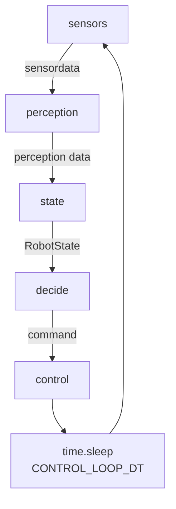

## main.py

main ei sisällä mitään robotti spesifistä logiikkaa

mainin tehtänä on käynnistää:
1. control looppi omassa säikeessä
2. käynnistää gui
3. käynnistää modbusworker säije
4. hallita sammutus prosessit

### Control loop
yksinketaistettuna

---