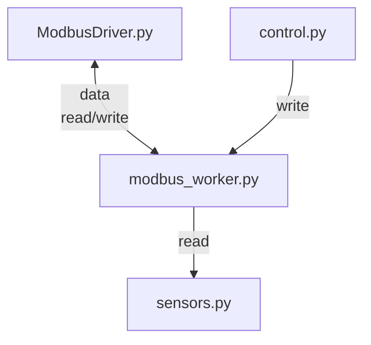
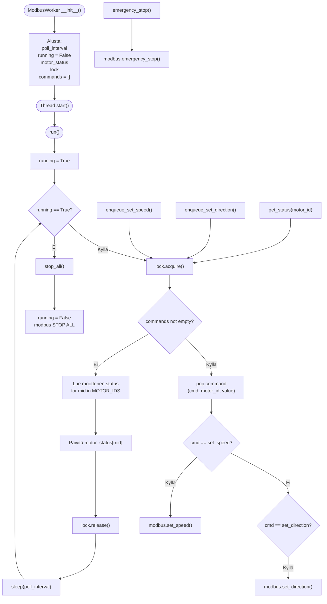

# modbus_worker.py

Moduulin tehtävänä on kerätä modbus väylään lähetettävät komennot yhteen ja hoitaa niitä omassa säikeessä. Moduulissa pyritään priorisoimaan kirjoitus käskyt ensisijaisiksi. 

## Riippuvuus ohjelma kokonaisuudessa

## Koodin toiminta periaate

