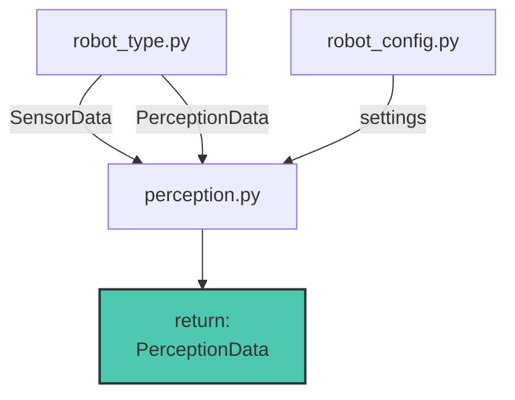
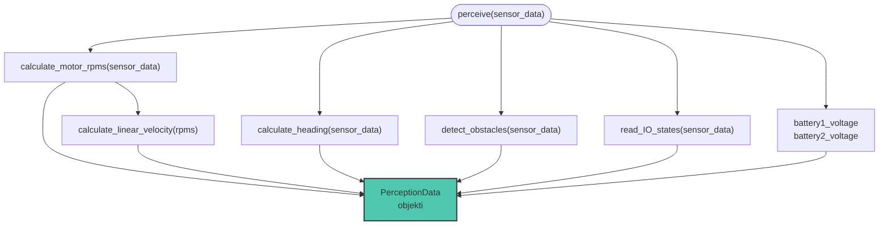
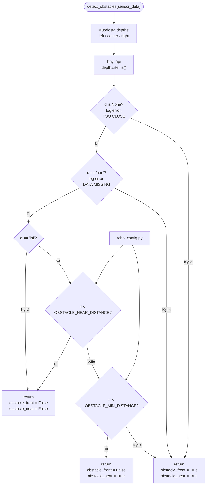

# Perception.py

Moduulin tehtävänä on lukea SensorData ja käsitellä haluttuun muotoon. 
Moduulin käsittelemät SensorData kerätään yhteen ja palautetaan PerceptionData objektina.

## Funktiot

moduulin pääfunktio jota käytetään mainissa. suorittaa käsittelyt ja kerää käsitellun datan yhteen paikkaan.
### perceive()

---
### calculate_motor_rpms(SensorData) -> dict

Funktio laskeen kaikkien Sensoridatasta olevien moottorien kierrosnopeuden moottori ohjaimen antamasta taajuudesta
jos taajuus on **None** niin annetaan kierrosnopeus 0.0. 
kierrosnopeus lasketaan $$n= f\cdot RPM\_{FACTOR} \cdot i $$  **RPM_FACTOR** ja **GEAR_RATIO** määritellään robot_config.py:ssä joka lasketaan

$$ RPM\_{FACTOR} = \frac {60}{p} $$

missä
$n =$ moottorin kierrosnopeus [1/min]
$p =$ moottorin napaparit
$i =$ välistys suhde (GEAR_RATIO)

funktio palauttaa dictionaryn jossa avaimet on motor1,motor3 motor4 ja motor6.

HUOM! pyörimissuuntaa ei huomioda ollenkaan

---

### calculate_linear_velocity(motor_rpms: dict[str,float]) -> float:

Funktio laskee lineaarinopeuden (m/s) moottoreiden kierrosnopeuksien keskiarvosta. 
$$ velocity = \frac {RPM_{avg} \cdot \pi \cdot D_{wheel}}{60} $$

**WHEEL_DIAMETER** määritellään robot_config.py:ssä.
Funktio palauttaa nopeuden nopeuden floattina ja jos kierrosnopeutta ei ole saatavilla niin nopeudeksi määritellään 0.0. 

HUOM! jos pyörimissuuntaa ei huomioda niin ja jos osa renkaista pyörii eri suuntaan niin nopeus ei vastaa todellisuutta. 

---

### calculate_heading(SensorData) -> float

Funktio tällä hetkellä välittää vain raakadatan eteenpäin, mutta jatkossa tässä voi tehdä tälle käsittelyitä.

---

### detect_obstacles(SensorData) -> tuple[bool, bool]

Katsotaan onko syvyys mittauksissa todettu että este olisi lähellä tai suoraan edessä joko näkökentän keskellä, vasemmassa reunassa tai oikeassa reunassa.
Rajat OBSTACLE_MIN_DISTANCE ja OBSTACLE_NEAR_DISTANCE määritellään robot_config.py:ssä.

palauttaa obstacle_front, obstacle_near totuus arvona. 

#### Vuokaavio toiminnasta

---

### read_IO_states(SensorData)

Lukee sensordatasta IO datan, ja palauttaa dictionaryn.
tällä hetkellä on vain määritelty että IO_data_1 on emmergency_stop ja IO_data_2 on reset_button.

emmergency_stop on määritelty niin että se on False jos IO_data_1 on 1, muuten True.

reset_button on True IO_data_2 on 1 muuten False

muut ei ole vielä käytössä.

----

