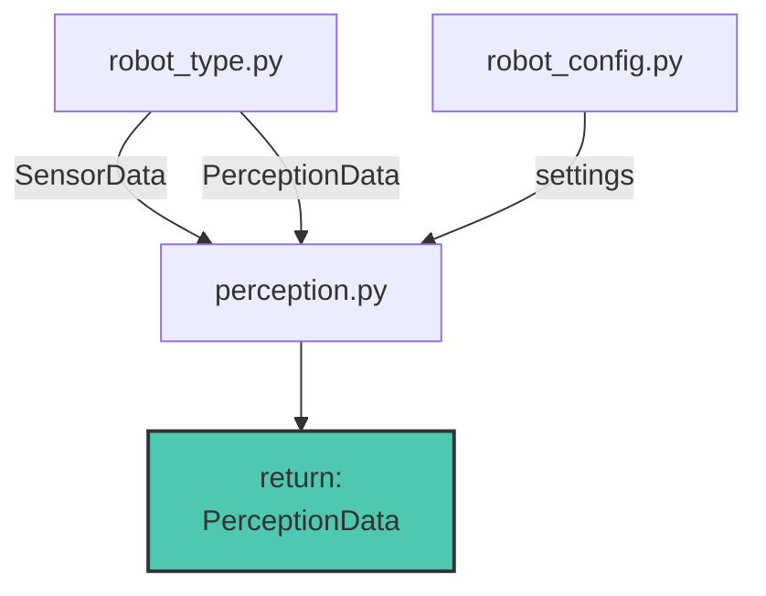

# Perception.py

Moduulin tehtävänä on lukea SensorData ja käsitellä haluttuun muotoon. 
Moduulin käsittelemät SensorData kerätään yhteen ja palautetaan PerceptionData objektina.

## Funktiot

moduulin pääfunktio jota käytetään mainissa. suorittaa käsittelyt ja kerää käsitellun datan yhteen paikkaan.
### perceive()

