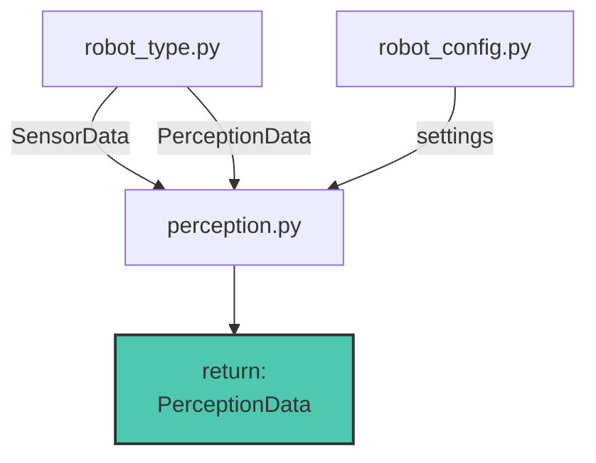
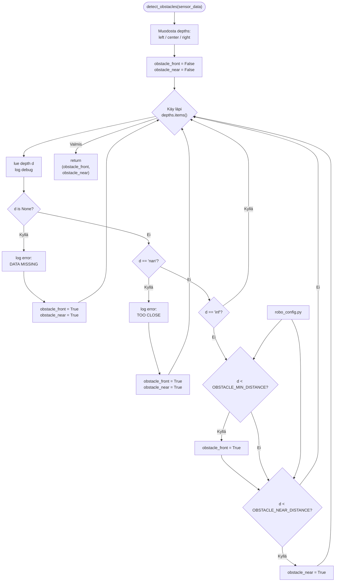

# Perception.py

Moduulin tehtävänä on lukea SensorData ja käsitellä haluttuun muotoon. 
Moduulin käsittelemät SensorData kerätään yhteen ja palautetaan PerceptionData objektina.

## Funktiot

moduulin pääfunktio jota käytetään mainissa. suorittaa käsittelyt ja kerää käsitellun datan yhteen paikkaan.
### perceive()

---
### calculate_motor_rpms(SensorData)
funktio laskeen kaikkien Sensoridatasta olevien moottorien kierrosnopeuden moottori ohjaimen antamasta taajuudesta
jos taajuus on **None** niin annetaan kierrosnopeus 0.0
kierrosnopeus lasketaan freg* RPM_FACTOR. RPM_FACTOR määritellään robot_config.py:ssä. 
funktio palauttaa dictionaryn jossa avaimet on motor1,motor3 motor4 ja motor6.

---

### calculate_heading(SensorData)
Funktio tällä hetkellä välittää vain raakadatan eteenpäin, mutta jatkossa tässä voi tehdä tälle käsittelyitä.

---

### detect_obstacles(SensorData)

Katsotaan onko syvyys mittauksissa todettu että este olisi lähellä tai suoraan edessä joko näkökentän keskellä, vasemmassa reunassa tai oikeassa reunassa.
Rajat OBSTACLE_MIN_DISTANCE ja OBSTACLE_NEAR_DISTANCE määritellään robot_config.py:ssä.

---

### read_IO_states(SensorData)

Lukee sensordatasta IO datan, ja palauttaa dictionaryn.
tällä hetkellä on vain määritelty että IO_data_1 on emmergency_stop ja IO_data_2 on reset_button.

emmergency_stop on määritelty niin että se on False jos IO_data_1 on 1, muuten True.

reset_button on True IO_data_2 on 1 muuten False

muut ei ole vielä käytössä.

----

