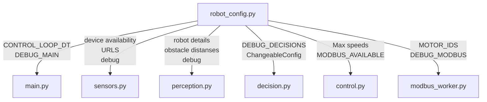

# robot_config

Moduulin tarkoituksena on määritellä robotin parametrit jotka ei muutu ajon aikana. Moduulissa luodaan myös configurointi tiedosto jota pystytään muuttaman guissa, jotta tarvittaessa voidaan muokata esimerkiksi oletusnopeuksia. Moduulissa määritellään muunmuassa renkaiden koko, kuinka moni napaiset moottorit on kyseessä ja lasketaan maksimi nopeus.

## Vuokaavio


## Device availability ja URLs
CAMERA_AVAILABLE, IMU_AVAILABLE, IO_AVAILABLE sekä CAMERA_URL,IO_URL ja IMU_URL  vakiot katsotaan järjestelmän ympäristö muuttujista jos niitä ei ole saatavilla niin oletetaan että laitteet ei ole käytössä.

ympäristö muuttujat määritellään hostissa samassa terminaalissa jossa ohjelma ajetaan esim.

```bash
export CAMERA_AVAILABLE=1
export CAMERA_URL="http://localhost:8000/depth"
jaskagui
```
## Moottorien määritys

POLES vakiossa määritellään kunka moni napainen moottori on ja POLE_PARES on napaparien määrä, eli puolet napojen määrästä.

RPM_FACTOR on apuvakio jota käytetään kierrosnopeuden (RPM)  määrittämisessä.

MAX_PULSES on testattu että kuinka monta pulssia tulee kun moottoria pyöritetään täydellä nopeudella.

## Nopeuksien määritykset

MAX_RPS on vakio maksimi kierrokset sekunnissa, joka on laskettu kaavalla 

$$N_{max}=\frac{N_{maxp}}{N_{pp}}$$

jossa

$N_{max}$ = MAX_RPS

${N_{maxp}}$ = MAX_PULSES

${N_{pp}}$ = POLE_PARES

MAX_RPM vakio on laskettu MAX_RPS vakiosta

Kun tiedetään maksimi kierrosnopeus vodaan laskea maksimi lineaarinopeus MAX_LINEAR_SPEED kaavalla 

$$v_{max}= \pi D_{wheel} N_{max}$$

MAX_ANGULAR_SPEED on vain arvioitu eikä perustu mihinkään todellisuuteen.

MAX_SPEED_VALUE on maksimi arvo joka annetaan moottori kortille voi olla jokin tasaluku alueelta 0-1000. Lukua laskemalla voidaan vaikuttaa moottorin maksimi nopeuteen todellisuudessa.

Muttamalla MAX_LINEAR_SPEED:ä tai MAX_ANGULAR_SPEED:ä ei voida varsinaisesti vaikuttaa robotin todelliseen nopeuteen, vaan nämä vaikuttaa nopeus ohjeen skaalaukseen.

Vakio nopeudet alustetaan ja niitä pystytään vaihtamaan guissa.

## Debug määritykset

muuttamalla debug vakiot Falsesta Trueksi saadaan konsoliin erillaisia debug tulosteita silloin kun selvitetään vikaa. Debug tulosteita voidaan lisätä koodiin esim.
### robor_config.py
```python
...
...
DEBUG_SENSOR_VALUES = True
...
...
```


### sensors.py

```python
import logging
from robot_config import DEBUG_SENSOR_VALUES

logger = logging.getLogger(__name__)
logger.setLevel(logging.DEBUG if DEBUG_SENSOR_VALUES else logging.INFO)
...
...
...
logger.debug("Tässä on debug tuloste")
```

## ChangeableConfig luokka

tänne lisätään kaikki parametrit joita pystytään muuttamaan guissa.

## load_config() funktio

lataa konfiguration tiedoston jos sellainen on saatavilla. mutta jos semmoista ei ole niin sitten se luodaan oletus arvoilla. Konfiguraatio tiedosto on sitä varten jotta voidaan
muokata haluttuja arvoja suoraan guista muokkaamatta varsinaista koodia ja sammuttamatta ohjelmaa. 

