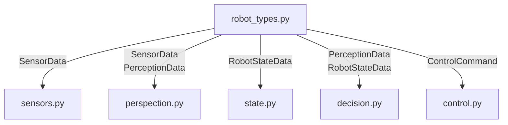

# robot_types.py

Moduulin tarkoituksena on on määritellä koko ohjelmasssa käytettävät yhtenäisest tietotyypit ja niiden rakenteet.
Varmistaa, että moduulit käyttävät yhtenäisiä datamuotoja ja helpottaa vian selvitystä. 


Oliot on määritelty muuttumattomiksi niin että yksittäisiä arvoja ei voi muokata olion sisällä vaan pitää luoda kokonaan uusi olio, näin vältetään muuttujien vaihtuminen vahingossa eri ohjelman vaiheissa tai moduuleissa. 

## esimerkki SensorData.

```python
@dataclass(frozen=True) # määritellään että data tyyppi on muuttumaton
class SensorData:
    motor1_measured_freq: float | None # Etu Paarpuuri
    motor3_measured_freq: float | None # Taka Paarpuuri 
    motor4_measured_freq: float | None # Etu Styyrpuuri
    motor6_measured_freq: float | None # Taka Styyrpuuri

    battery1_voltage: float | None  # Akun 1 jännite
    battery2_voltage: float | None  # Akun 2 jännite 

    cam_measured_depth_left: float | None  # kameran mittaama etäisyys vasen
    cam_measured_depth_center: float | None # kameran mittaama etäisyys keskellä
    cam_measured_depth_right: float | None # kameran mittaama etäisyys oikea
    
    IMU_heading_x: float # imun suuntima x akselin mukaan
    IMU_heading_y: float # imu suuntima y askelin mukaan
    IMU_heading_z: float # imu suuntima z akselin mukaan
    
    IO_data_1: int  # TODO: Lisää dataa
    IO_data_2: int
    IO_data_3: int
    IO_data_4: int
    IO_data_5: int

```