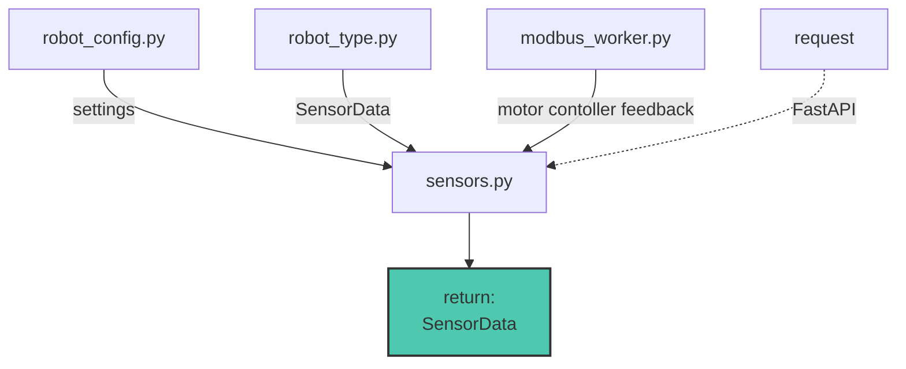
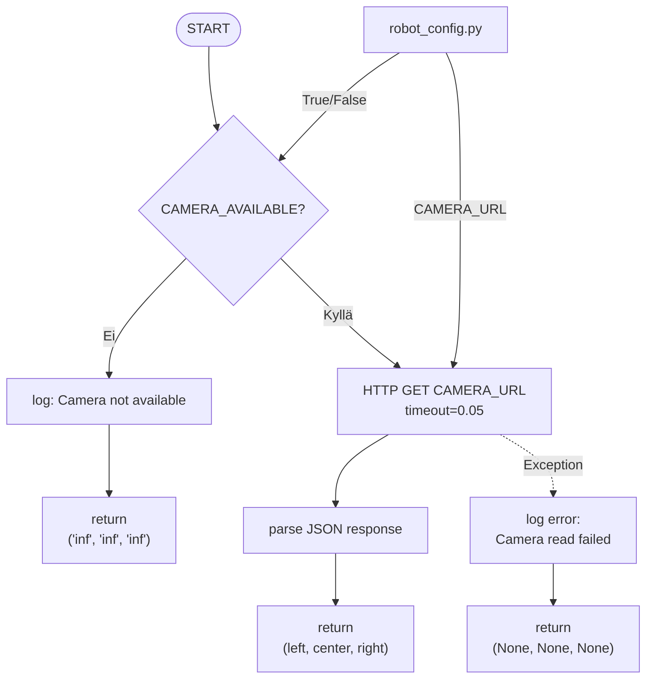
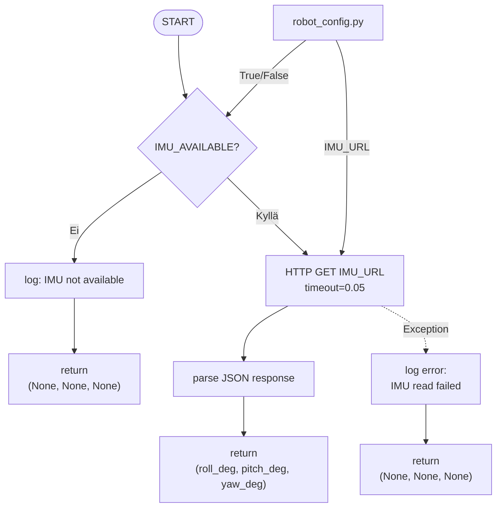
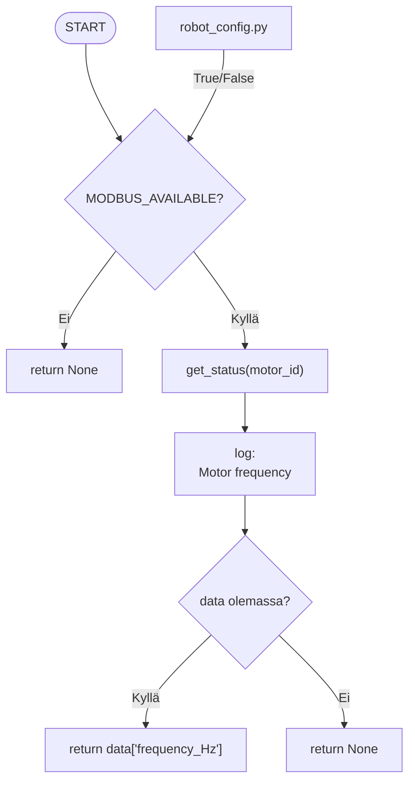
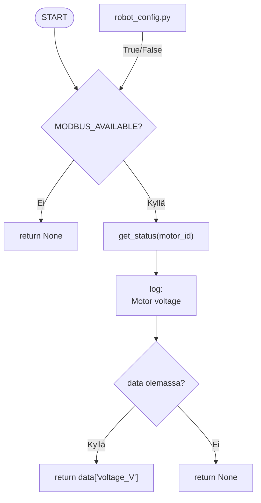
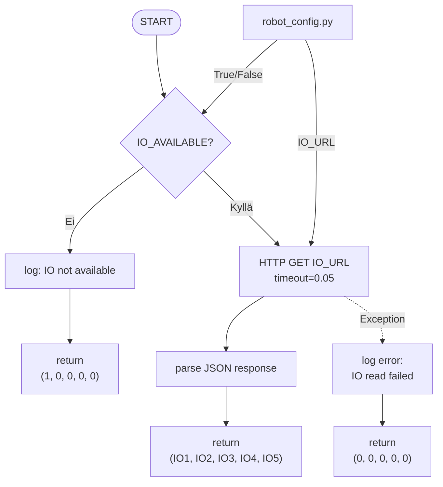
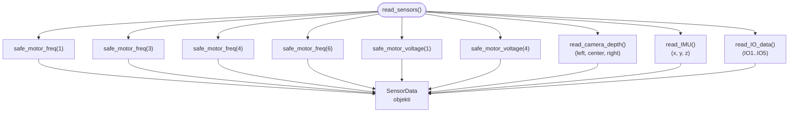

## sensors.py

vastaa sensoreiden lukemisesta eri lähteistä, kerätä ne yhteen ja palauttaa SensorData objektina.

### Funktiot

#### read_camera_depth()
Jos kamera ei ole käytössä niin kameran syvyys arvot ovat äärettömiä jotta robottia pystytään ajamaan.
Muuten kameraan syvyys dataa yritetään lukea HTTP requestillä, mutta dataa ei onnistuta saamaan palautetaan **None** arvot.

#### read_IMU()

Jos IMU ei ole käytössä tai IMUn dataa ei saada requestillä niin arvot ovat **None**

#### safe_motor_freq()
Luetaan moottorin hall anturin taajuus moottori kortilta modbusworkerin kautta,
jos ei ole mahdollista saada dataa niin palautetaan arvo **None**

#### safe_motor_voltage()
Luetaan moottori kortille tulevä jännite,
jos ei ole mahdollista saada dataa niin palautetaan arvo **None**

#### read_IO_data():
Lisätty mahdollisuus IO:n lukemiseen.
IO1 on varattu hätäseisille ja IO2 on reset napille.

#### read_sensors()
Tällä funktiolla varsinaisesti kerätään kaikki data yhteen SensorData objektiin josta voi muutmoduulit sensori tiedot. 
