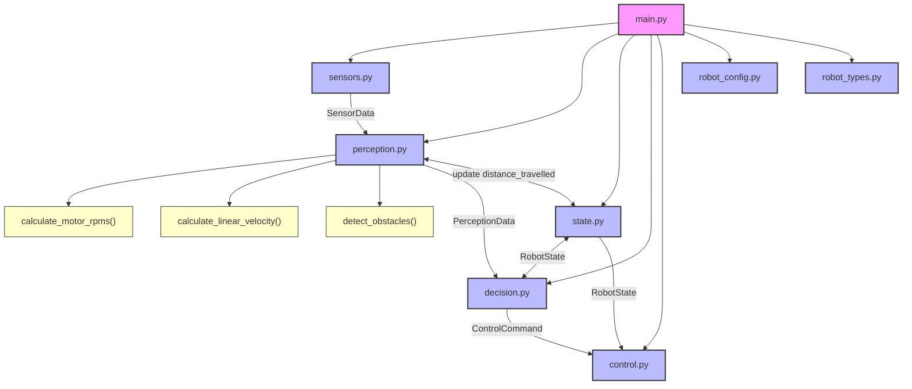

# Automatisointi suunnitelma

## Rakenne

Ohjelma jaetaan yhteen pääohjelmaan ja seitsemään aliohjelmaan.

* main.py
* types.py
* sensors.py
* perception.py
* decision.py
* control.py
* state.py
* config.py

### main.py

Pääohjelma, joka suorittaa robottia jatkuvassa silmukassa.
yhdistää kaikki moduulit toisiinsa, mutta ei sisällä päätöksen tekologiikkaa.

vastuut:

* pääsilmukka
* tilan välitys kierrokselta toiselle
* kutsuu muita moduuleja

### types.py

Määrittelee koko ohjelmassa käytettävät yhteiset tietotyypit ja niiden rakenteet. Varsmistaa, että moduulit käyttävät keskenään yhtenäisiä datamuotoja.

esim.

 ``` python

from dataclasses import dataclass

@dataclass(frozen=True)
class SensorData:
    motor1_measured_RPM: float
    motor3_measured_RPM: float
    motor4_measured_RPM: float
    motor6_measured_RPM: float

@dataclass(frozen=True)
class RobotState:
    mode: str
    last_turn: str | None
```
### sensors.py

Kerää datan eri sensoreilta (esim. IMU, Kamera) ja palauttaa sen yhtenäisessä muodossa.

### perception.py

Tulkaa sensoridatan korkeammalle tasolle. Muuntaa raakadataa robottia ohjaaviksi havainnoiksi

Esim. 

* Este edessä / ei estettä
* mitattu nopeus tällä hetkellä (sensoridatasta)
* suuntima /headind (asteta)

### decision.py

Sisältää päätöksentekologiikan ja tilakoneen.
päättää robotille annettavat käskyt havainnoinnin ja nykytilan perusteella.

* pysähdy
* aja eteen
* käänny vasemmalle / oikealle

### control.py

Muuntaa päätökset konkreettisiksi moottori- ja ohjauskomennoiksi.

Vastuut: 
* nopeudet
* kääntöliikkeet
* rajapinta moottori ohjaimiin.

### state.py

Määrittelee  robotin sisäisen tilan ja muistin, joka kulkee kierrokselta toiselle.

Esimerkkejä:
* nykyinen toimintatila
* edellinen tila
* käännöksen suunta
* tilassa vietetty aika tai askeleet

### config.py

Sisältää kaikki säädettävät parametrit ja raja-arvot, jotka eivät muutu ajonaikana.

Esimerkiksi:
* renkaan koko
* maksimi- ja perusnopeudet
* esteen minimi etäisyys
* aikarajat


## Vuokaavio
### Legend
- 🟣 Main program
- 🔵 Module

- 🟡 Function


